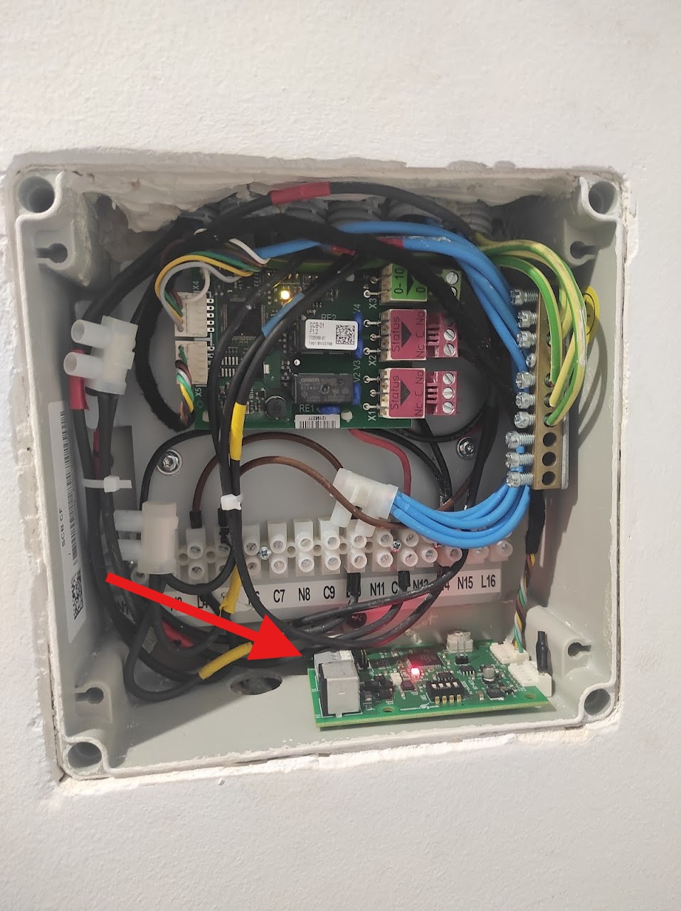
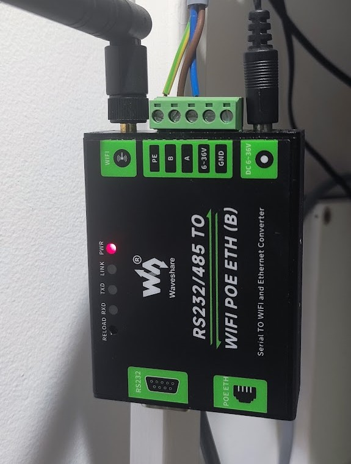
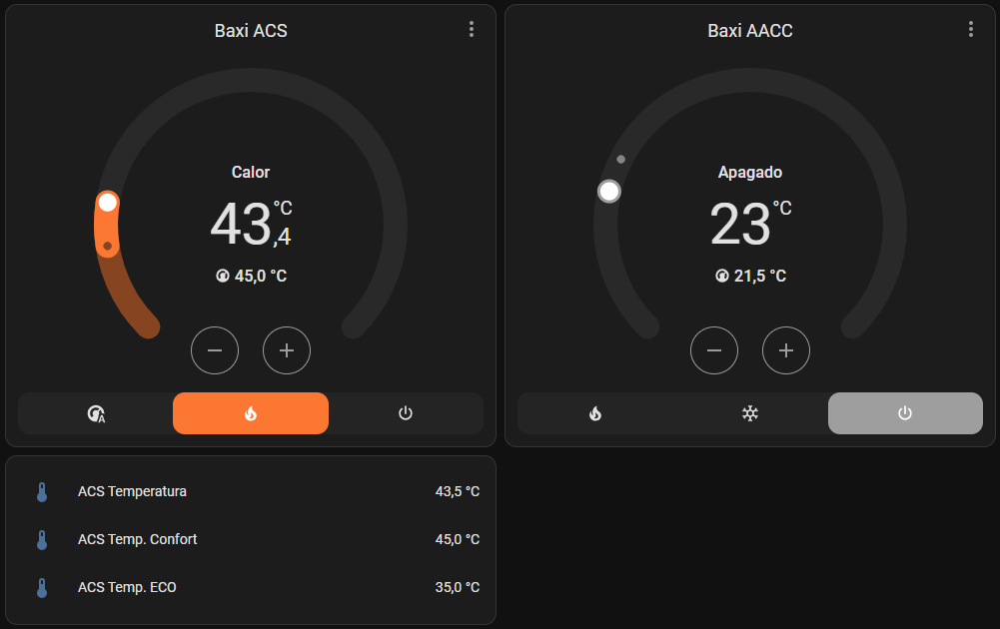

# Welcome to my first project!

Hi!
This is Imanol82.
Here you have my first project.
With this project we can connect any Baxi/Dietrich/Remeha Aerothermal with Home Assistant using Modbus. 
For this we will need the GTW-08 that converts the RBus into Modbus.

My system has 2 Zones. Zone 1 is the HVAC and Zone 2 is the DHW

I have created two simple thermostats to control DHW and HVAC.

Over time we will complete it more.

Thanks!

-----------------------------------------------------------------------------------------------------------------------------------

# Installation:

First of all you need a GTW-08 gateway to convert the RBus signal to Modbus:



Now that we have the signal converted to Modbus, we will use a Mondus-TCP to be able to read the system:



Now we will only have to copy the modbus.yaml file to the same directory where we have the configuration.yaml.

modbus.yaml:
```
- name: Baxi
  type: tcp
  host: 192.168.31.117  #your Modbus-TCP ip.
  port: 502
  delay: 2


############################## SENSORS ##############################


  sensors:


#################### ACS ####################


    - name: "ACS Temperatura"                           # DhwTankTemperature
      slave: 100
      address: 1631
      input_type: holding
      data_type: int16
      scan_interval: 5
      device_class: temperature
      unit_of_measurement: °C
      state_class: measurement
      scale: 0.01
      precision: 1

    - name: "ACS Temp. Confort"                         # ZoneDhwComfortSetpoint
      slave: 100
      address: 1177
      input_type: holding
      data_type: int16
      scan_interval: 5
      device_class: temperature
      unit_of_measurement: °C
      state_class: measurement
      scale: 0.01
      precision: 1

    - name: "ACS Temp. ECO"                             # ZoneDhwReducedSetpoint
      slave: 100
      address: 1178
      input_type: holding
      data_type: int16
      scan_interval: 5
      device_class: temperature
      unit_of_measurement: °C
      state_class: measurement
      scale: 0.01
      precision: 1

    - name: "ACS bit Actividad"                         # ZoneCurrentActivities
      slave: 100
      address: 1619
      input_type: holding
      data_type: int16
      scan_interval: 5


#################### CLIMATIZACION ####################


    - name: "AACC Temperatura"                          # ZoneTRoom
      slave: 100
      address: 1104
      input_type: holding
      data_type: int16
      scan_interval: 5
      device_class: temperature
      unit_of_measurement: °C
      state_class: measurement
      scale: 0.1
      precision: 1

    - name: "AACC Temp. Consigna"                       # ZoneRoomManualSetpoint
      slave: 100
      address: 664
      input_type: holding
      data_type: int16
      scan_interval: 5
      device_class: temperature
      unit_of_measurement: °C
      state_class: measurement
      scale: 0.1
      precision: 1


############################## CLIMATES ##############################


  climates:


#################### ACS ####################


    - name: "Baxi ACS Confort"                          # Climate Confort
      unique_id: baxi_acs_confort
      slave: 100
      address: 1631
      input_type: holding
      data_type: uint16
      scan_interval: 5
      max_temp: 65
      min_temp: 40
      precision: 1
      scale: 0.01
      temp_step: 0.5
      temperature_unit: C
      target_temp_register: 1177
      hvac_mode_register:
        address: 1161
        values:
          state_auto: 0
          state_heat: 1
          state_off: 2

    - name: "Baxi ACS ECO"                              # Climate ECO
      unique_id: baxi_acs_eco
      slave: 100
      address: 1631
      input_type: holding
      data_type: uint16
      scan_interval: 5
      max_temp: 45
      min_temp: 30
      precision: 1
      scale: 0.01
      temp_step: 0.5
      temperature_unit: C
      target_temp_register: 1178
      hvac_mode_register:
        address: 1161
        values:
          state_auto: 0
          state_heat: 1
          state_off: 2


#################### CLIMATIZACION ####################

    - name: "Baxi AACC"                                 # Climate AACC
      unique_id: baxi_aacc
      slave: 100
      address: 1104
      input_type: holding
      data_type: uint16
      scan_interval: 5
      max_temp: 45
      min_temp: 15
      precision: 1
      scale: 0.1
      temp_step: 0.5
      temperature_unit: C
      target_temp_register: 664
      hvac_mode_register:
        address: 503
        values:
          state_heat: 0
          state_cool: 1
      fan_mode_register:
        address: 649
        values:
          state_fan_on: 1
          state_fan_off: 2
      hvac_onoff_register: 500

```


In configuration.yaml you must add the following text:
```
modbus: !include modbus.yaml
```

Now we will have 3 new Climate entities:
- Baxi AACC (for HVAC)
- Baxi ACS Confort (for DHW Confort)
- Baxi ACS ECO (for DHW ECO)

In the case of the DHW, I have created 2 different climates because the On/Off and the scheduler are controlled from the system. 
The only thing we will do is select the Manual/Scheduler/Off mode and the Comfort/ECO temperatures.
We will configure the scheduler in the system itself (later I will change this and add the option to work with the Home Assistant scheduler)

In the case of HVAC, I want to use the Home Assistant scheduler, so we can select between Manual/Off, and select the Cooling/Heating work mode.

Example of the dashboard of the 2 climates:



For the two Climates, Comfort/Eco of the DHW, to work as a single one, I have set a condition that hides the Comfort/Eco climate that is not being used.

The code for the DHW Card:

```
type: vertical-stack
cards:
  - type: conditional
    conditions:
      - condition: state
        entity: sensor.acs_bit_actividad
        state: "1"
    card:
      type: thermostat
      entity: climate.baxi_acs_eco
      features:
        - type: climate-hvac-modes
      show_current_as_primary: true
  - type: conditional
    conditions:
      - condition: state
        entity: sensor.acs_bit_actividad
        state_not: "1"
    card:
      type: thermostat
      entity: climate.baxi_acs_confort
      show_current_as_primary: true
      features:
        - type: climate-hvac-modes
  - type: entities
    entities:
      - entity: sensor.acs_temperatura
      - entity: sensor.acs_temp_confort
      - entity: sensor.acs_temp_eco

```
Video to understand 2 climates in one:

[](https://www.youtube.com/watch?v=fH2bT5B7qUY)

Well, I hope this project is useful and I hope to improve it with everyone's help. 
To be able to do this, I have received a lot of help from the telegram group "Aerothermia España/De Dietrich". 
# Thank you very much!

